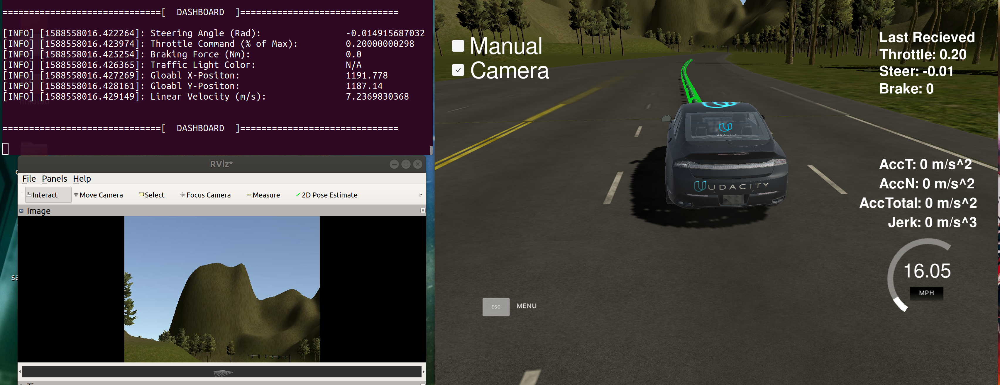
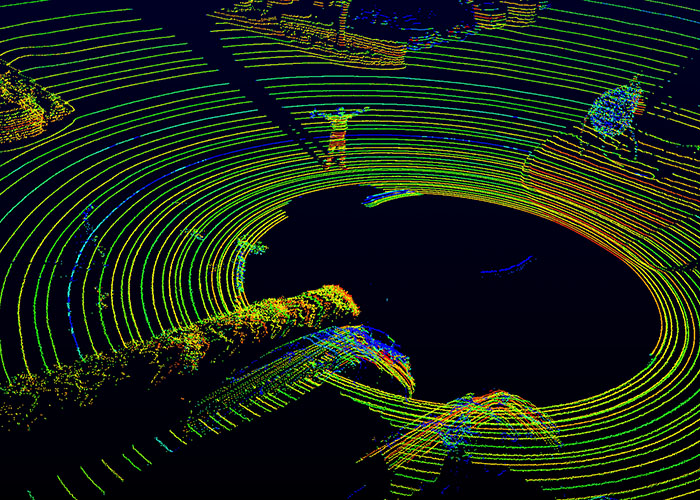
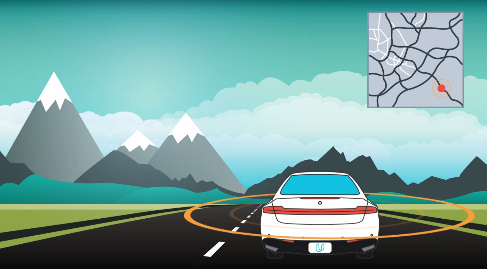
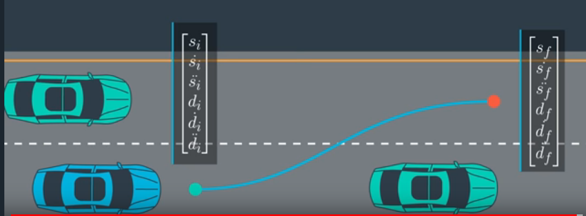

# Self-Driving Car Engineer Nanodegree Capstone Project:  System Integration for an Autonomous Vehicle

*Team Lead: Adrian Chow*

*Team Members: Nikhil Parla, Olaoluwa Popoola, Xiaoxuan Chen*

The purpose of this capstone project is to combine the skills garnered by the students in Udacity's Self-driving Car Engineering Nanodegree in order to program Carla, Udacity's self-driving car platform.  The students combined skills in computer vision, vehicle control systems, and integration through the Robot Operating System ([ROS](https://www.ros.org>)) in order to drive the car around a test track.

## Project Goal

The following project aims to develop a coherent system that can communicate and perform tasks at a scaled-down level from an full-scale autonomous vehicle.

1. Implement a path planning sub-system to plan short-term paths.
2. Implement a vehicle controller sub-system to stay in a lane.
3. Implement a traffic light state detector using a camera in order to plan behaviour at traffic lights.

## Project Environments

The project operates on two stages: A Unity Simulator and Udacity's Autonomous Vehicle located in Mountain View, California.

### 1. Unity Simulator

Unity Game Engine allows Udacity to provide a simulated environment for students to test their software on. In this case, the simulator presented a virtual 3D environment with several traffic lanes and traffic lights. As a result, students can perform a validation check to whether their car stays in a given lane or stops before a traffic light. Simulation is a standard measure for testing performance and safety for many automotive applications. Testing software on simulation before implementation on a real autonomous vehicle is the reality that many self-driving car companies such as NVIDIA, Uber and Mercedes. 

***Figure 1: Simulator showing car under autonomous mode.*** *Carla, Udacity's Autnomous Vehicle, driving in the simulator in autonomous mode. On the left is a dashboard display and a stream of the car's camera.*

### 2. Carla, Udacity's Self-Driving Car Platform 

Upon passing anticipated behaviours on simulation, the software is then ready to be tested on Carla. It is important to note that the environment is signafigantly different from the simulation. To begin, the track is different from what is seen in the simulator which should be fine. In addition, the traffic lights on the real test track were different such that there must be a object detection model taylored to real-life data. (See below)

***Figure 2: Carla, Udacity's Self-Driving Car Platform.*** *Carla is a fully equiped self-driving car with sensors, a perception module, a planning system and controls.*

# Carla's Architecture

Carla can be divided into several subsystems:

  1. Sensors
  2. Perception
  3. Planning
  4. Control
  

***Figure 3: A visualization of Carla's autonomous subsystems.*** *The four modules work independently but exchange data via robot operating system (ROS) nodes.*

## 1. Senors

  Sensors are the hardware components the car uses to observe the world around it. Carla uses several sensors such as GPS, IMU, Radar, and Lidar. In addition, several cameras can be also used to provide imaging of the driving path. In industry, autonomous vehicles rely on Radar and Lidar sensors to provide the distance to the nearest objects. On the flipside, the GPU provides the global coordinates of the car in order to provide a mapping reference. The inertial measure unit (IMU) is useful to measure any positional or angular displacements. 

  The project mainly uses the camera images to process information about possible on-coming traffic lights. This information is then processed to the perception sub-system.

  
  
  ***Figure 4: A visualization of a point cloud mapping provided from a LIDAR sensor.*** *Lidar is one of the many sensors Carla uses to gather information about the world around.*

## 2. Perception

  The perception sub-system is in charge of processing data from the sensor subsystem into structured information for the rest of the sub-systems. The components of the perception subsystem can be grouped into two blocks: detection and localization. The project focuses mainly on detection, since the a need to percieve the state of traffic lights.

### 2a. Detection
  
  To be written....

### 2b. Localization

  GPS can only localize Carla to within 10 centimeters or less. The car relies on Lidar to determine the precise location. In this project, there is no need to localize the car relative to the objects around it. There are no nearby cars since the car will be tested in a controlled environment.

***Figure 5: During localization an autonomous vehicle must use GPS and Lidar data.*** *Carla localizes herself by figuring out where she is on a high-definition map*

## 3. Planning

  The planning sub-system is in-charge of many subdivisions which determine the ultimate behaviour of the vehicle. Autonomous vehicles must always be planning ahead of time, thus planning is the most computational intensive subsystem.  There are several types of planning that need to be covered.

  1. Route Planning
    - Responsible for high-level decisions about the path of the vehicle between two points on a map.
    - Component is similar to the route planning feature found on many smartphones or modern car navigation systems.
            
  2. Prediction Planning
    - Prediction component estimates what actions other objects might take in the future. 
    - If another vehicle were identified, the prediction component would estimate its trajectory

  3. Behavioural Planning
    -  Behavioural planning component determines what behaviour the vehicle should exhibit at any point in time.
    -  E.g Lane Change, Accelerating, Making left turn, all maneuvers.

  4. Trajectory Planning
    -  Based on the desired immediate behaviour, the trajectory planning component will determine which trajectory is best for executing this behaviour.

  The planning system used in this project follows the basis of ***waypoints***—a series of coordinates that are updated as the car moves through the environment. Whether to stay in lane or to make a left lane change, the waypoints are essentially the commands to tell the car how it should behave for the next several seconds. In this project, the waypoints are constantly updating at 50Hz to ensure the car is constantly fed the most up to date commands.

***Figure 6: A visualization for Trajectory path-planning.*** *For example, a lane change to the left might be comprised of 20-40 equidistant waypoints in the form of a smooth *s* shape over a 30 meter span.*

## 4. Control

  The control sub-system is equipped with the task of making sure the plan is executed properly. Two common controllers are the PID Controller and the Model Predictive Controller, in which we learned earlier in the nanodegree. For this project, the following tools are used:

  1. PID Controller
  2. Yaw Controller
  3. Low Pass Filter

  The PID controller is used to monitor the throttle commands sent to Carla, which is done by using feed-back control. Next, the Yaw controller is in charge in sending steering commands based on the offset relative to the current lane. Lastly, there is a low pass filter to remove any noise exeisting from velocity commands to ensure stability. Carla is equipped with a drive-by-wire controller to communicate throttle, steering and braking commands.

  

  ***Figure 7: A diagram that illistrates the components of the proportional–integral–derivative controller .*** *Carla uses a proportional-integral-derivative (PID) controller.*